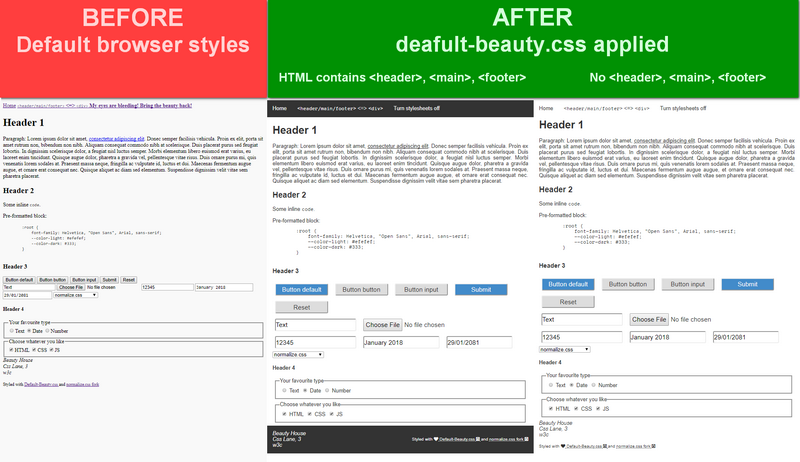

# default-beauty.css

[](https://github.com/OleksiyRudenko/default-beauty.css/blob/master/LICENSE.md)
[](https://www.w3.org/TR/css-variables-1/)

 - [ ] Building quick web page/app prototype?
 - [ ] Want to see anything more pleasant than default
       browser styling from the very first page load?
 - [ ] A beginner focused more on HTML?

If anything above is what you would tick then this project
will be of use for you.

The idea behind is to beautify a bit default styles whenever
you just cannot (or just do not want to) pay much efforts to styling yet.

[](image/default-beauty-big.png)

[Check live demo](https://oleksiyrudenko.github.io/default-beauty.css/).

Note that [index.html](index.html) contains no style or element class definitions
(with exception of pre-formatted block contents).

<!-- START doctoc generated TOC please keep comment here to allow auto update -->
<!-- DON'T EDIT THIS SECTION, INSTEAD RE-RUN doctoc TO UPDATE -->
## Table of Contents

- [Installation](#installation)
  - [Installation options](#installation-options)
  - [Fonts](#fonts)
- [Special features](#special-features)
  - [CSS3 variables](#css3-variables)
  - [Page `<header>` and `<footer>`](#page-header-and-footer)
  - [`<nav>` element](#nav-element)
- [Credits to the project](#credits-to-the-project)
- [TODO](#todo)
- [Credits](#credits)

<!-- END doctoc generated TOC please keep comment here to allow auto update -->

## Installation

Tastes best with [`normalize.css`](https://github.com/necolas/normalize.css)
and with
[a font of your choice](https://fonts.google.com/)
to improve default typography readability.

### Installation options

Use either of the methods:
 1. NPM: `npm install --save normalize.css && npm install --save default-beauty.css`
    or `yarn add normalize.css && yarn add default-beauty.css`
 1. Use a CDN of your choice to include
    [normalize.css](https://yarnpkg.com/en/package/normalize.css) and
    [default-beauty.css](https://yarnpkg.com/en/package/default-beauty.css)
 1. Download latest releases of
    [normalize.css](https://necolas.github.io/normalize.css/latest/normalize.css) and
    [default-beauty.css](https://github.com/OleksiyRudenko/default-beauty.css/releases)

### Fonts

You may find the following snippet sufficient to start with.
Just add it to your web page's `<head>` to have a bit better typography right off.

```
    <link rel="stylesheet" href="https://fonts.googleapis.com/css?family=Overpass%20Mono">
    <link rel="stylesheet" href="https://fonts.googleapis.com/css?family=Open+Sans">
    <link rel="stylesheet" href="https://use.fontawesome.com/releases/v5.0.4/css/all.css">
```

[TOC :arrow_double_up: ](#table-of-contents)

## Special features

Feel free changing whatever you like.

### CSS3 variables

`default-beauty.css` employs
[CSS variables](https://www.w3.org/TR/css-variables-1/)
(more on [MDN](https://developer.mozilla.org/en-US/docs/Web/CSS/Using_CSS_variables))
with a somewhat not a 100% browser support and therefore may not pass
[strict validation](https://jigsaw.w3.org/css-validator/validator?uri=https%3A%2F%2Frawgit.com%2FOleksiyRudenko%2Fdefault-beauty.css%2Fmaster%2Fdefault-beauty.css&profile=css3svg&usermedium=all&warning=1&vextwarning=&lang=en).

Should you face any issues with it, please
[let me know](https://github.com/OleksiyRudenko/default-beauty.css/issues).

Quick fix:
1. Download `default-beauty.css` or fork this project
2. Replace every `var(--...)` with a relevant value from `:root` section
3. Remove variable definitions from `:root` section

### Page `<header>` and `<footer>`

Just add &lt;header&gt; and &lt;footer&gt; elements to have distinctive
styling of your page header and footer.

Both `<header>` and `<footer>` are
[flex boxes](https://css-tricks.com/snippets/css/a-guide-to-flexbox/)
with `flex-flow: row`.

Last element in the `<footer>` (and first as well if it is the only element
in the `<footer>`) floats to the right. If this not what you want
remove `margin-left: auto;` rule from `footer > *:last-child` ruleset.

### `<nav>` element

`<nav>` is a
[flex box](https://css-tricks.com/snippets/css/a-guide-to-flexbox/)
with `flex-flow: row`.

Every its direct child is assigned a `margin-right`.

[TOC :arrow_double_up: ](#table-of-contents)

## Credits to the project

If you like this project, please, give it a :star: on
[github](https://github.com/OleksiyRudenko/default-beauty.css)
and/or add the following somewhere in the bottom
of your beautified page.

```
    <p><small>
       Styled with
       <a href="https://github.com/necolas/normalize.css" target="_blank">
           normalize.css <i class="fab fa-github-square"></i>
       </a>
       and
       <a href="https://github.com/OleksiyRudenko/default-beauty.css" target="_blank">
           <i class="fas fa-heart"></i> Default-Beauty.css <i class="fab fa-github-square"></i>
       </a>
   </small></p>
```

It will look like this (but beautified):
**Styled with
 <a href="https://github.com/necolas/normalize.css" target="_blank">
     normalize.css <i class="fab fa-github-square"></i>
 </a>
 and
 <a href="https://github.com/OleksiyRudenko/default-beauty.css" target="_blank">
     <i class="fas fa-heart"></i> Default-Beauty.css <i class="fab fa-github-square"></i>
 </a>**

[TOC :arrow_double_up: ](#table-of-contents)

## TODO

Check [project issues](https://github.com/OleksiyRudenko/default-beauty.css/issues).

Any suggestions or bugs? Please, check
[notes on contribution](https://github.com/OleksiyRudenko/default-beauty.css/blob/master/CONTRIBUTING.md).

[TOC :arrow_double_up: ](#table-of-contents)

## Credits

This project wouldn't have ever happened without
[%3D-Kottans-lightgrey.svg)](https://github.com/kottans)

[TOC :arrow_double_up: ](#table-of-contents)
